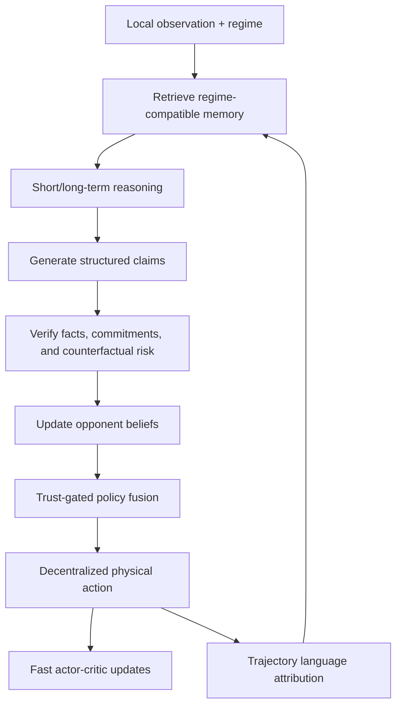

# TRACE-MAP

Implementation for Trust-Aware Attribution and Counterfactual Credibility in Language-Guided Multi-Agent
Economic Policy Learning.”**

TRACE-MAP studies language-guided economic policy learning in a partially
observable game with one government and heterogeneous households. It treats
language as a source of evidence whose relevance, credibility, strategic risk,
and downstream utility must be estimated before it affects an action.


## Method at a glance



The implementation includes:

- attribution-guided memory retrieval with semantic, regime, reliability, and
  staleness terms;
- short-, long-, and inactive reasoning modes;
- structured message claims and Bait/Switch/Edge-style counterfactual audits;
- credibility-calibrated Bayesian opponent beliefs and behavioral refinement;
- trust-weighted message pooling and centralized-training/decentralized-execution
  actor–critic networks;
- sampled unilateral-deviation regularization;
- trajectory-level language credit and batched textual-policy revision;
- E1/E2/E3 macroeconomic conditions, C0–C3 communication conditions, regime
  shifts, ablations, metrics, seed aggregation, and latency evaluation.

## Quick start: fully offline smoke run

Python 3.10 is recommended.

```bash
python -m venv .venv
source .venv/bin/activate
pip install -e .
trace-map smoke --config configs/smoke.yaml --output results/generated/smoke
```


Run the dependency-light tests with:

```bash
python -m unittest discover -s tests -v
```

## Full TaxAI setup

The paper uses the external
[TaxAI simulator](https://github.com/jidiai/TaxAI).

```bash
pip install -e ".[train,language,taxai]"
bash scripts/setup_taxai.sh
```

For the paper-scale language stack, ensure that the Qwen3-32B and BGE-M3 model
weights are locally accessible, then edit `configs/base.yaml` if their model IDs
or paths differ. Full runs require substantial GPU memory. A smaller model may
be supplied for engineering tests, but such a run is not paper-comparable.

```bash
trace-map train \
  --config configs/base.yaml \
  --override configs/environment/e1.yaml \
  --override configs/communication/c0.yaml \
  --output results/generated/e1_c0_seed0
```

```bash
# All E1/E2/E3 × C0/C1/C2/C3 evaluations and regime shifts
bash scripts/reproduce_paper.sh

# One quick end-to-end check
bash scripts/run_smoke.sh

# Aggregate completed seed logs
trace-map aggregate \
  --input results/generated \
  --output results/generated/summary.json
```


## License

MIT License.
