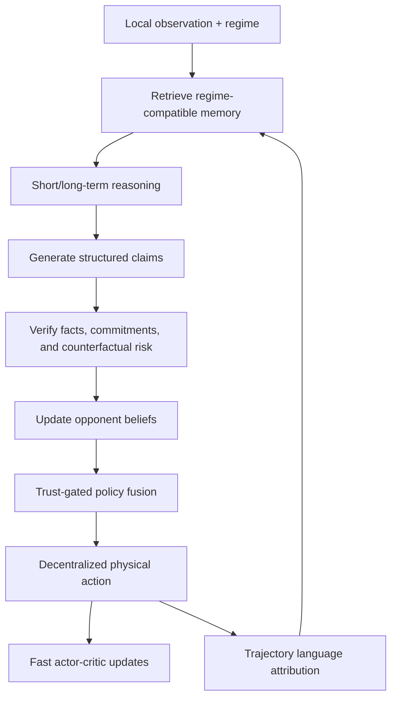

# TRACE-MAP

Reference implementation for **“Who Said What, and Did It Help? Trust-Aware
Attribution and Counterfactual Credibility in Language-Guided Multi-Agent
Economic Policy Learning.”**

TRACE-MAP studies language-guided economic policy learning in a partially
observable game with one government and heterogeneous households. It treats
language as a source of evidence whose relevance, credibility, strategic risk,
and downstream utility must be estimated before it affects an action.

> **Reproducibility status.** This repository is a transparent implementation
> reconstructed from the manuscript specification. The manuscript fixes the
> principal architecture, environment conditions, and headline hyperparameters,
> but it does not provide the original prompts, checkpoints, seed logs, all loss
> weights, or raw experimental outputs. Those gaps are labeled as
> `implementation_default` in the configuration. The values under
> `results/reference/` are manuscript claims, not outputs generated by this code.

## Method at a glance



The implementation includes:

- attribution-guided memory retrieval with semantic, regime, reliability, and
  staleness terms;
- short-, long-, and inactive reasoning modes;
- structured message claims and Bait/Switch/Edge-style counterfactual audits;
- credibility-calibrated Bayesian opponent beliefs and behavioral refinement;
- trust-weighted message pooling and centralized-training/decentralized-execution
  actor–critic networks;
- sampled unilateral-deviation regularization;
- trajectory-level language credit and batched textual-policy revision;
- E1/E2/E3 macroeconomic conditions, C0–C3 communication conditions, regime
  shifts, ablations, metrics, seed aggregation, and latency evaluation.

## Quick start: fully offline smoke run

Python 3.10 is recommended.

```bash
python -m venv .venv
source .venv/bin/activate
pip install -e .
trace-map smoke --config configs/smoke.yaml --output results/generated/smoke
```

The smoke command uses a small deterministic economy, hashing text embeddings,
and template language generation. It exercises the complete
retrieve–reason–communicate–verify–infer–act–attribute–update path without model
downloads or TaxAI.

Run the dependency-light tests with:

```bash
python -m unittest discover -s tests -v
```

## Full TaxAI setup

The paper uses the external
[TaxAI simulator](https://github.com/jidiai/TaxAI). It is intentionally not
vendored because its upstream repository currently has no explicit license.
The setup script checks out the exact revision used while constructing this
repository (`04e7cb17071d942366eb0cad4fb4ba57d02bf612`).

```bash
pip install -e ".[train,language,taxai]"
bash scripts/setup_taxai.sh
```

For the paper-scale language stack, ensure that the Qwen3-32B and BGE-M3 model
weights are locally accessible, then edit `configs/base.yaml` if their model IDs
or paths differ. Full runs require substantial GPU memory. A smaller model may
be supplied for engineering tests, but such a run is not paper-comparable.

```bash
trace-map train \
  --config configs/base.yaml \
  --override configs/environment/e1.yaml \
  --override configs/communication/c0.yaml \
  --output results/generated/e1_c0_seed0
```

## Reproduction commands

The orchestration scripts enumerate the five manuscript seeds and preserve a
resolved configuration beside every run.

```bash
# All E1/E2/E3 × C0/C1/C2/C3 evaluations and regime shifts
bash scripts/reproduce_paper.sh

# One quick end-to-end check
bash scripts/run_smoke.sh

# Aggregate completed seed logs
trace-map aggregate \
  --input results/generated \
  --output results/generated/summary.json
```

No script silently inserts the values reported in the paper. Missing
checkpoints, incomplete seeds, and unavailable optional dependencies fail with
an actionable message.

## Repository layout

| Path | Purpose |
| --- | --- |
| `src/trace_map/` | Core framework, environments, language adapters, models, trainer, metrics, and CLI |
| `configs/` | Paper defaults, stress regimes, communication conditions, and ablations |
| `scripts/` | TaxAI setup, smoke run, and experiment orchestration |
| `tests/` | Deterministic unit and integration tests |
| `docs/` | Architecture, TaxAI mapping, experiment protocol, and paper-to-code traceability |
| `results/reference/` | Manuscript-reported targets, clearly separated from generated results |
| `results/generated/` | Local logs, checkpoints, and summaries (ignored by Git) |
| `paper/` | Citation and artifact notes; the submitted manuscript is not redistributed |

See [REPOSITORY_MANIFEST.md](REPOSITORY_MANIFEST.md) for the complete file
inventory and [REPRODUCIBILITY.md](REPRODUCIBILITY.md) for the evidence required
before claiming numerical reproduction.

## Configuration provenance

Each YAML field is annotated in comments as one of:

- `manuscript`: stated explicitly in the paper;
- `upstream_taxai`: read from the pinned TaxAI interface;
- `implementation_default`: necessary engineering choice not stated in the paper;
- `smoke_only`: reduced setting used only for tests.

Command-line overrides are saved to `resolved_config.yaml` in the output folder.

## License

The included notice reserves rights while the author selects a release license.
Replace `LICENSE` before publishing if you intend others to reuse or modify the
code. TaxAI and downloaded model weights remain governed by their respective
terms.
